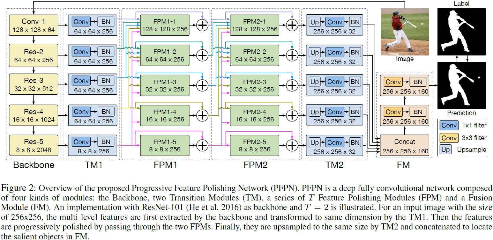
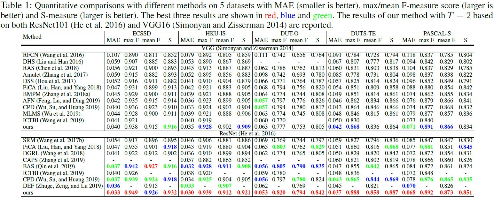
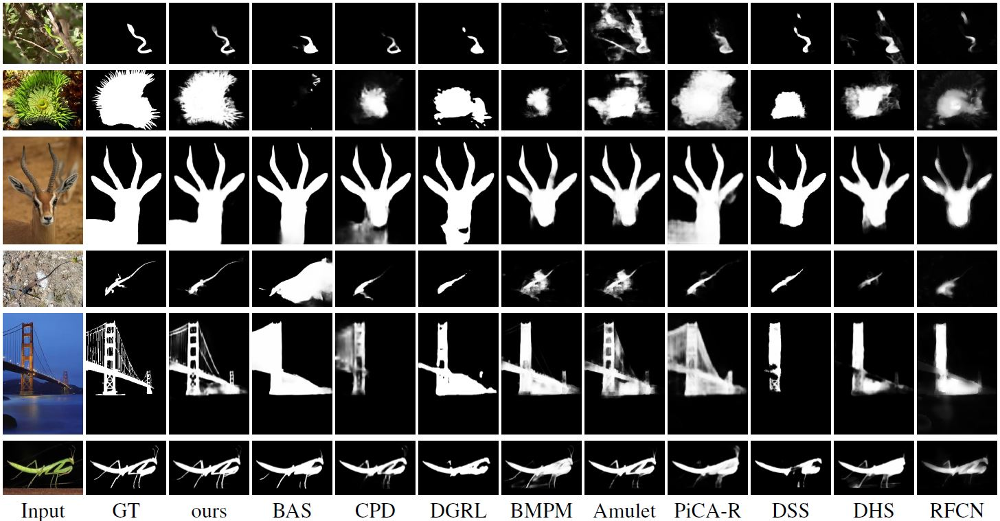

# Progressive Feature Polishing Network for Salient Object Detection

## Contents

* [Introduction](#Introduction)
* [Installation](#Installation)
* [Quick demo](#Quick demo)
* [Prepare data](#Prepare data)
* [Training PFPN](#Training PFPN)
* [Testing PFPN](#Testing PFPN)
* [Evaluation](#Evaluation)
* [Experiments](#Experiments)
* [Citation](#Citation)

## Introduction
This repository is the official implementation of PFPN for salient object detection, 
which is proposed in [Progressive Feature Polishing Network for Salient Object Detection](https://arxiv.org/abs/1911.05942).



## Installation
The code was tested with CentOS7 with Anaconda environment:
* CUDA 10
* python 3.7.1
* Pytorch 1.0.0
* numpy 1.15.4
* opencv-python 3.4.5
* scikit-image 0.14.1
* tensorboardX 1.6
* tqdm 4.28.1

## Quick demo
* Run the command `sh shells/demo.sh` to detect default image. 
To speed up pretrained model downloading,
you can download the pretrained PFPN model ([Google Drive]() or [Baidu Netdisk]()) to the local directory (models/pretrained) by yourself.

* To test your own image, please change the parameter of `--image-path` in `shells/demo.sh`.

## Prepare data
* To make a quick preparation, you can run the command `sh shells/download_data.sh`
to download 5 common datasets:
[ECSSD](http://www.cse.cuhk.edu.hk/leojia/projects/hsaliency/dataset.html),
[HKU-IS](https://sites.google.com/site/ligb86/mdfsaliency/),
[DUTS](http://saliencydetection.net/duts/),
[DUT-OMRON](http://saliencydetection.net/dut-omron/),
[PASCAL-S](http://www.cbi.gatech.edu/salobj/)
(Be sure that you have installed unzip and rar).

* You can also prepare your own datasets. First, in `data`, you should create a
folder `$your_own_dataset_name$` which includes all your data.
And then, record all image and groundtruth paths in `$your_own_dataset_name_train.conf` and `$your_own_dataset_name_valid.conf`.

## Training PFPN
* After preparing data, run the command `sh shells/train.sh` to start training PFPN.
Because of difference of machines, some settings in `shells/train.sh` should be modified.

* To train our model on your own dataset, modify dataset-dir in `shells/train.sh`.
Because of difference of machines, some settings in `shells/train.sh` should be modified.

## Testing PFPN
After modification of `shell/test.sh` according to your machine, PFPN testing can be run by `sh shell/test.sh`.

## Evaluation
We implement four metrics: MAE(Mean Absolute Error), F-Measure, S-Measure[2] and E-Measure[1].
#### Quick evaluation
After preparing data, to make a quick evaluation for PFPN on 5 dataset: ECSSD, HKU-IS, DUTS, DUT-OMRON and PASCAL-S,
you can download predicted saliency maps of PFPN([Google Drive]() or [Baidu Netdisk]()).
And then create folder `res_vis/PFPN` in root directory of this project and extract those results to this folder.
The path structure looks like this:

````bash
res_vis
├──── PFPN
│    ├──── ECSSD
│    ├──── HKU-IS
│    ├──── DUTS
│    ├──── DUT-OMRON
│    └──── PASCAL-S
```` 

Finally, run `shells/evaluation.sh` to start evaluating:

#### API
You can use `Evaluation` in `utils/evaluation.py` to calculate these four metrics, for example:

```python
    saliency_evaluation = SaliencyEvaluation()
    saliency_evaluation.clear()
    # pred is predicted saliency map, gt is groundtruth
    saliency_evaluation.add_one(pred, gt)
    # get_evaluation would return mean results of all metrics
    MAE, Precision, Recall, F_m, S_m, E_m = saliency_evaluation.get_evaluation()
```

## Experiments
### Quantitative Comparison


### Qualitative Comparison


## Citation

````
@article{pfpn,
  title = {Progressive Feature Polishing Network for Salient Object Detection},
  author = {Bo, Wang and Quan, Chen and Min, Zhou and Zhiqiang, Zhang and Xiaogang, Jin and Kun, Gai},
  booktitle = {arXiv:1911.05942v1},
  year = {2019}
}
````

## Reference
[1] Fan D P, Gong C, Cao Y, et al. Enhanced-alignment measure for binary foreground map evaluation[J]. arXiv preprint arXiv:1805.10421, 2018.

[2] Fan D P, Cheng M M, Liu Y, et al. Structure-measure: A new way to evaluate foreground maps[C]. Proceedings of the IEEE international conference on computer vision. 2017: 4548-4557.
